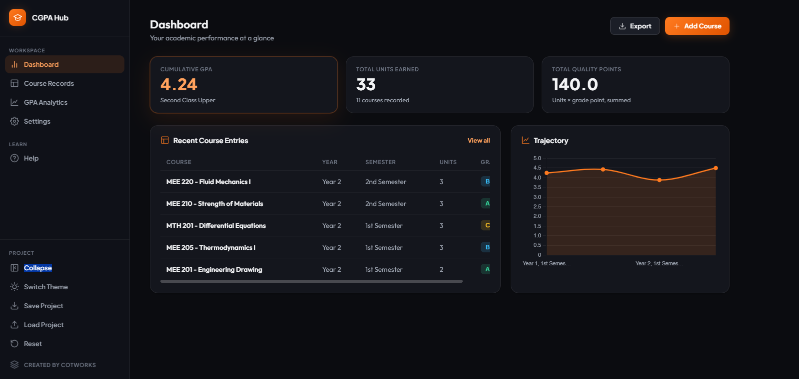

# CGPA Hub

This is a complete academic performance tracker built around GPA and CGPA calculation. You log courses with their year, semester, units, and grade, and it turns that record into semester-by-semester GPA, a cumulative CGPA, a performance trend, and a plain-English breakdown of what the numbers mean.

**[Live Demo](https://crypticot.github.io/cgpa-hub/)**



---

## Why this exists

No two schools grade the same way. Point scales differ, classification cutoffs differ, and some programs run three semesters a year while others run two. Most GPA calculators assume one fixed scale and force you to adapt your numbers to fit it.

This tool works the other way around: the grading scale, the classification bands, and the years and semesters themselves are all editable, not hardcoded. Rename a semester, add a grade, change what a "First Class" requires, and every label and calculation across the app updates to match, because it started as a personal spreadsheet built around one specific school's rules, and generalising it meant making every rule a setting instead of an assumption.

It also treats the record as something you'll keep adding to over years, not something you calculate once. Filtering, sorting, and comparing matter as much as the CGPA number itself.

---

## What it does

- **Dashboard**: cumulative GPA, total units, and total quality points at a glance, plus your most recent course entries and a compact trend chart
- **Course Records**: add, edit, and delete courses; filter by year and semester with dropdowns that narrow to combinations that actually exist in your data; Excel-style multi-column sorting, click a header to sort, click again to flip direction, click a third time to clear it, with numbered badges showing sort priority when more than one column is active
- **GPA Analytics**: a full trajectory chart plotting every semester in order with no filter, so the overall direction is always visible; KPI cards that adjust to whatever filter is applied to the course comparison chart, while best and weakest semester always look at the full record since that comparison only makes sense across everything; a course comparison chart, sortable highest-to-lowest or reset back to entry order
- **Settings**: rename or add years and semesters, edit the grading scale completely (add, remove, or rename grades and change their point values), and edit classification bands (the names and minimum CGPA cutoffs used to label your standing); the tool blocks deleting a year, semester, or grade still referenced by a course and tells you which entries are using it
- **Help**: a full walkthrough covering what GPA and CGPA actually mean, the calculation with a worked example, how retakes are handled, and how filtering and sorting work, plus a one-click "Try it with example data" button
- **Save and Load**: export your full project state as a JSON file and reload it later or on another device
- **Persistent local storage**: your workspace saves automatically between sessions
- **Light and dark themes**, a collapsible sidebar, and full mobile responsiveness with a bottom navigation bar

---

## Tech stack

Built entirely in vanilla HTML, CSS, and JavaScript. Just open `index.html`.

- [Chart.js](https://www.chartjs.org/): the trajectory and course comparison charts
- Google Fonts: Plus Jakarta Sans (headings) + Outfit (body)

---

## Running it locally

```bash
git clone https://github.com/crypticot/REPO-NAME.git
cd REPO-NAME
```

Open `index.html` in any browser. No dependencies to install, no server required.

---

## A few design decisions worth knowing

**Why retakes aren't a special flag.** If you took a course more than once, you add it again as a new entry, and both attempts count toward your CGPA by default. That matches how most institutions actually compute it. If your school only counts one attempt, you delete the entry you don't want counted. A dedicated "retake" toggle would have meant guessing at rules that vary by school; deletion is unambiguous.

**Why CGPA isn't an average of semester GPAs.** It's a weighted total: every quality point earned, divided by every unit taken, across the whole record. A semester with more units carries more weight in that total, the same way it would in a real transcript. Averaging the semester GPAs directly would quietly misweight lighter and heavier semesters against each other.

**Why best and weakest semester ignore the active filter.** Everything else in GPA Analytics reacts to the year/semester filter, but comparing "best" and "weakest" only means something across your full record. Scoping that comparison to a single filtered semester would just return that one semester every time.

**Why you can't delete a year, semester, or grade that's still in use.** Removing one silently would leave courses pointing at a label that no longer exists, corrupting the GPA math for that entry. The tool stops you and names the entries using it instead, so you fix the data first.

---

## Built by

**Chidubem Ojukwu** · [Portfolio](https://crypticot.github.io/cotworks-portfolio/) · [LinkedIn](https://linkedin.com/in/ojukwuii)

Built as part of a learning project, and exists independently as a tool for anyone tracking their GPA across a program with its own grading rules.
